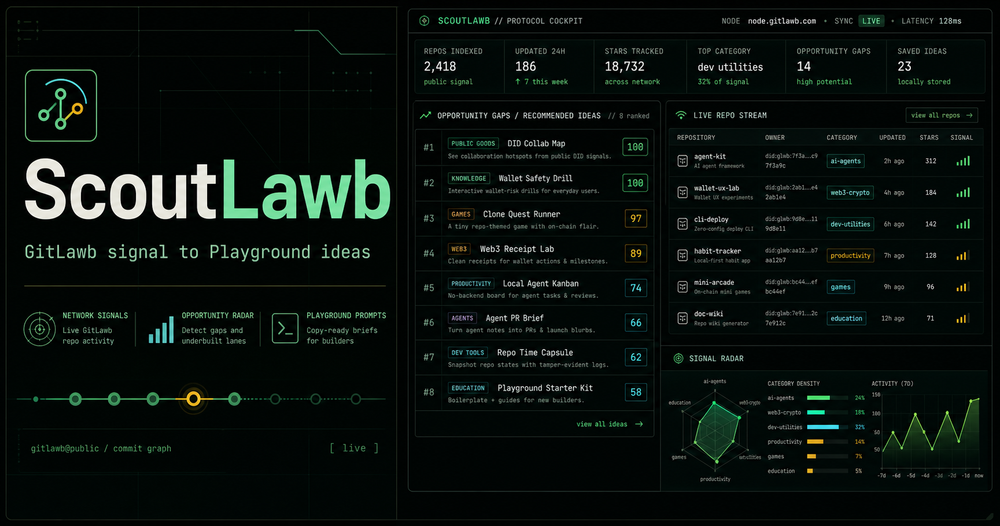

# ScoutLawb



ScoutLawb turns public GitLawb network signals into Playground-ready project ideas. It is a build intelligence cockpit, not a generic repo explorer: repo data is used to detect patterns, crowded categories, underbuilt lanes, and prompt opportunities.

## Features

- Live GitLawb repo stream with search, sorting, clone URL copy, and repo-based prompt copy
- Opportunity gaps ranked from public repo activity, category density, recency, and builder goals
- Builder filters for easy builds, shareability, GitLawb usefulness, hackathon-fit, agent-native workflows, local-first apps, and no-backend builds
- Selected idea detail with target user, why GitLawb, why now, feature scope, checklist, and copy actions
- Prompt Studio with copy-ready GitLawb Playground prompts
- Custom MiMo prompt direction for steering generated ideas
- LocalStorage for saved ideas, compare tray, repo cache, and preferences
- Markdown export for launch-ready project briefs
- Same-origin GitLawb repo proxy for live data on ngrok/Vite preview, with sample fallback if the network is blocked

## Setup

```bash
npm install
npm run dev
```

Open the local URL printed by Vite.

## Environment

The app works without an AI key by using deterministic local scoring. To enable MiMo generation, configure:

```bash
cp .env.example .env.local
```

Then set:

```txt
VITE_MIMO_BASE_URL=https://token-plan-sgp.xiaomimimo.com/v1
VITE_MIMO_MODEL=mimo-v2.5-pro
VITE_MIMO_API_KEY=...
```

Important: `VITE_` environment variables are bundled into client-side JavaScript. That is acceptable for local/private demos, but public production deployments should put the key behind a protected proxy.

## Scripts

```bash
npm run typecheck
npm run lint
npm run build
npm run preview
```

## GitLawb API

ScoutLawb reads public repos from:

```txt
https://node.gitlawb.com/api/v1/repos
```

In Vite dev/preview it also exposes a same-origin proxy:

```txt
/api/gitlawb/repos
```

The proxy avoids browser CORS issues when sharing the app through ngrok. ScoutLawb does not write to GitLawb and does not pretend to create repos automatically.

## Deploy

Build the app:

```bash
npm run build
```

Deploy the generated `dist/` directory. For a public production deployment, add protected server-side proxies for MiMo and GitLawb if you need live API access without exposing client-side keys.
